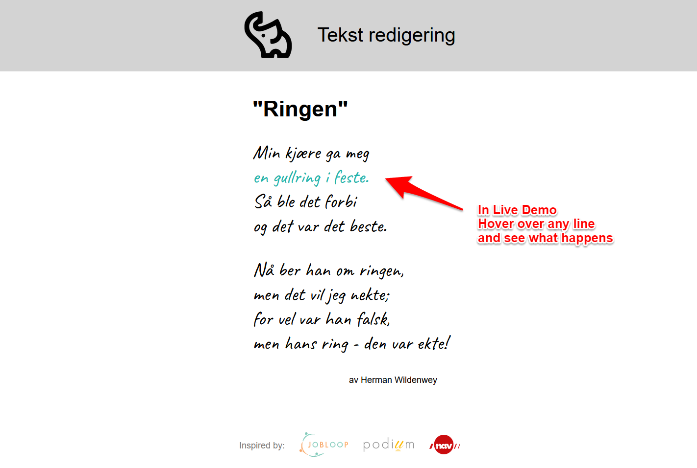

# Buttons del 2

[Source code](https://github.com/chriskodehub/KH-6_tekst_redigering)  
[Live demo](https://chriskodehub.github.io/KH-6_tekst_redigering/)

## Oppgave

Her skal du redigere teksten slik den blir presentabel
Bruk taggene som du har lært (`<h1>`,`
`....) til å formatere diktet under.

"Ringen" av Herman Wildenwey

Min kjære ga meg  
en gullring i feste.  
Så ble det forbi  
og det var det beste.  
  
Nå ber han om ringen,  
men det vil jeg nekte;  
for vel var han falsk,  
men hans ring - den var ekte!  
  
Du står fritt om du vil gjøre diktet fancy med farger og bilder - eller levere inn teksten helt enkelt. Dette er for at Harisha skal kunne vurdere arbeidet deres, når hun får tilgang til Dokker. 
Neste fredag blir det introduksjon til CSS. Fint om dere bruker litt av det dere lærte av Harisha i dag.

## Demo
